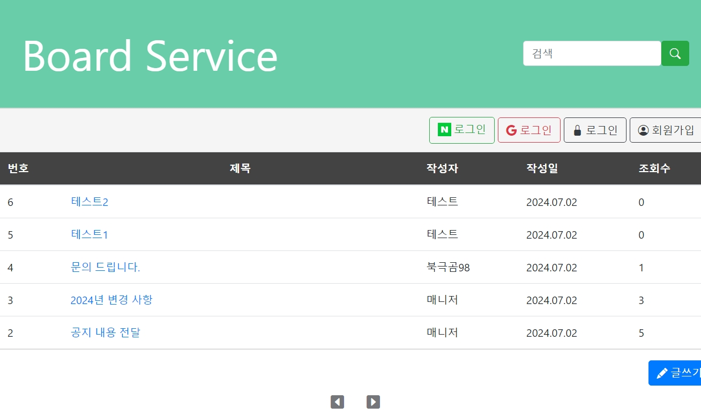
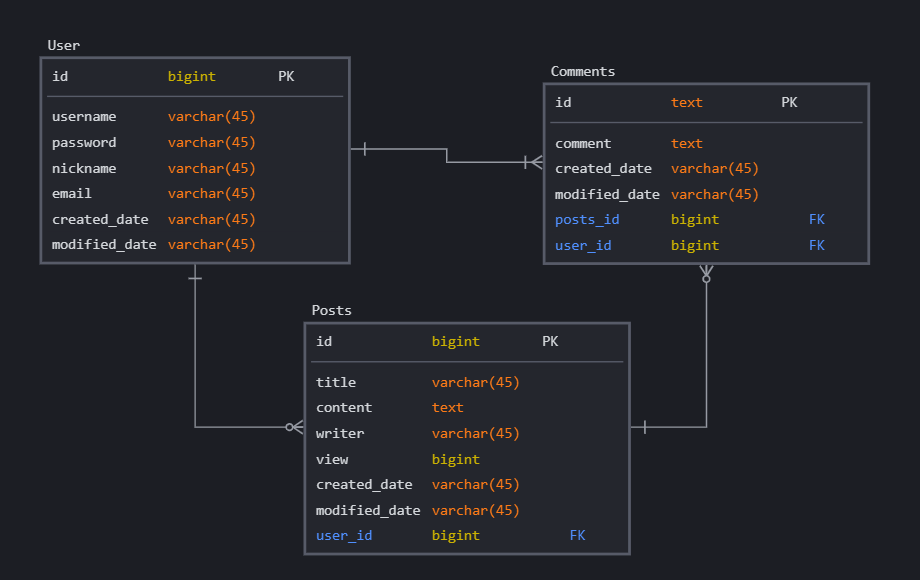
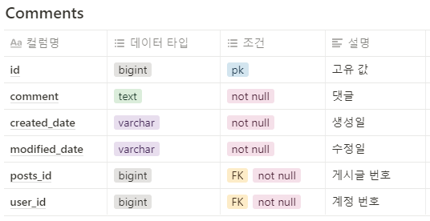
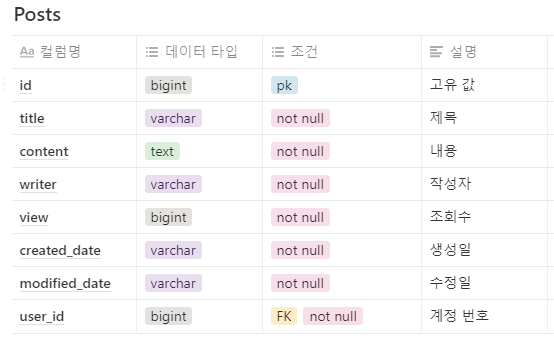
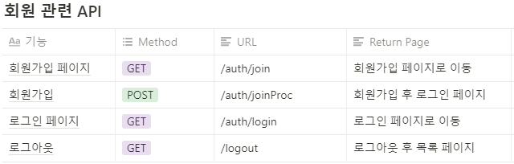
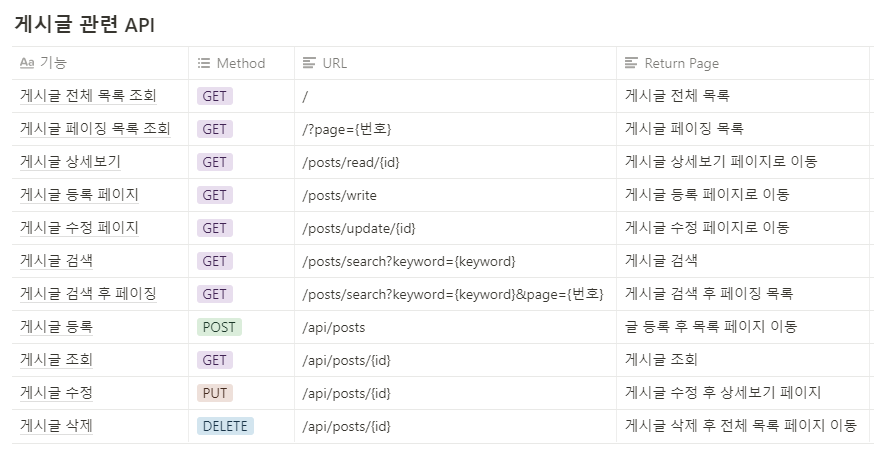
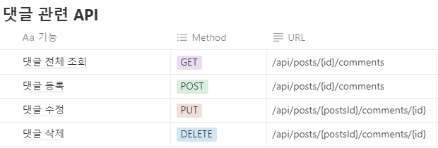

# 게시판 프로젝트

# 소개

**스프링**과 **스프링 부트 JPA** 에 개념을 따로 공부 하였지만 응용을 적용하여 게시판을 직접 짜기에는 어려움이 있어 기존의 코드를 참고한 프로젝트 입니다.참고한 코드의 출처를 밝히며 기존 코드의 
유지/보수와 배포 작업을 직접하고 작업한 코드를 다시 분석하여 완전히 이해하는데 노력 하였습니다.

---

## 기능 및 사용 기술

### **프로젝트 기능**

- **게시판 -** CRUD 기능, 조회수, 페이징 및 검색 처리
- **사용자 -** Security 회원가입 및 로그인, OAuth 2.0 구글, 네이버 로그인, 회원정보 수정, 
회원가입 시 유효성 검사 및 중복 검사
- **댓글 -** CRUD 기능

### **사용 기술**

**BackEnd**

**주요 프레임워크 / 라이브러리**

- Java17
- SpringBoot 3.2.5
- Spring Security 3.2.5
- JPA(Spring Data JPA)
- OAuth 2.0

**Build Tool**

- Gradle 7.2

**DataBase**

- MySQL 8.0.33

**FrontEnd**

- Html/Css
- JavaScript
- ThymeLeaf
- Bootstrap 4.3.1

### 구조 및 설계

- **기능별 구조**
    - 게시판 기능 / 댓글 기능
    : SpringBoot 와 JPA를 사용하려 하다 보니 MVC 구조의  형식을 볼 수 있는데,
    **Controller**를 통해 외부의 요청을 받아오면 **Repository**의 JPA를 사용한 접근으로 Data를 저장하고 **Service** 를 통해 비즈니스 로직과 함께 Repository 를 사용하는 구조를 갖는다.
    - 회원 관리기능
    : 게시판/댓글 기능과 유사한 구조에 추가로 Spring Security 과 OAuth 2.0 를 사용한 구조
    

- **API 설계**
    
    
    
    
    
    
    
---
    
- **API 설계**
    
    
    
    
    
    
    

---

# 구현 및 개발

엔티티( User / Comments / Posts ) 를 기준으로 관련 기능 설명

### **공통 기능**

[Date 관련 컬럼에 관한 엔티티](https://transparent-baron-9db.notion.site/Date-e46cebaabe6d465e9e5c6b209e5214e7?pvs=74)

[HTML공통 구성 요소 Header/Footer](https://transparent-baron-9db.notion.site/HTML-Header-Footer-d7fb5b2781bd430ea1a829f4b0cddaa3)

[도메인 관련(Entity)](https://transparent-baron-9db.notion.site/Entity-4baede46aea54d9e8dd03bfd1914be3e)

[엔티티 관련 DTO](https://transparent-baron-9db.notion.site/DTO-e4796b1ecaac44c5b495db7268744b97)

[JavaScript 와 유효성 검사 관련(app.js)](https://transparent-baron-9db.notion.site/JavaScript-app-js-a7aa307c3044477393d4dd2cf4e80303)

### **게시판 기능**

[[Posts]게시판 글쓰기 관련](https://transparent-baron-9db.notion.site/Posts-dfc81b46584243cc99d56502743755ce)

[[Posts]게시글 수정및 삭제 제한 기능](https://transparent-baron-9db.notion.site/Posts-3d034e6ce38c417996d0a6677fb3006c)

[[Posts]게시판 조회수 증가와 검색 기능](https://transparent-baron-9db.notion.site/Posts-f0bf7d8ed2414ad8a05fec2132fbfb6d)

[[Posts]게시판 페이징 처리 관련](https://transparent-baron-9db.notion.site/Posts-aea9acce7bfe4d0ca271e1c244c2870f)

### **댓글 기능**

[[Comment]댓글 작성 및 조회 관련](https://transparent-baron-9db.notion.site/Comment-521d5bae537048239ed934e9037cfd4c)

[[Comment]댓글 수정및 삭제 + 수정/삭제 제한 기능 ](https://transparent-baron-9db.notion.site/Comment-21f0668fb2c44907beadcfa9d6f4bbc4)

### **회원 관리 기능( Spring Security / OAuth 2.0 개념 추가 )**
[Spring Security 의 개념과 원리](https://transparent-baron-9db.notion.site/Spring-Security-5b192d4dabf14c79b3af7d7868176521)

[Spring Security 를 이용한 회원가입 및 로그인](https://transparent-baron-9db.notion.site/Spring-Security-1cb8b41398094b2da5fe7c9f5cc213ad)

[Spring Security 로그인 실패 처리](https://transparent-baron-9db.notion.site/Spring-Security-0c769208385f4ea0a08ee70ee9395760)

&nbsp;

[JPA 연관관계를 통한 작성자 구분](https://transparent-baron-9db.notion.site/JPA-500d2f26f6924f5eb1ca5b874eb90f68)

[회원가입 유효성 검사와 중복검사(Validation)](https://transparent-baron-9db.notion.site/Validation-26954e291c5f4a688c750785f8fed9d6)

[[User]기존 회원정보 수정 기능](https://transparent-baron-9db.notion.site/User-e1ad5ed6adb441c5b376372bc40187dc)

&nbsp;

[OAuth2.0 의 개념과 원리](https://transparent-baron-9db.notion.site/OAuth2-0-9b2e9be233a143f89422fe74e6a53c7e)

[OAuth 2.0 를 이용한 로그인 기능[구글]](https://transparent-baron-9db.notion.site/OAuth-2-0-739067e99ccf49a5810ce99b53c6f16e)

[OAuth 2.0 를 이용한 로그인 기능[네이버]](https://transparent-baron-9db.notion.site/OAuth-2-0-2a69edee8f4d478db50f0aafcbe7cb35)

### 구현 과정중 발생한 문제점

[구현 중 Error 사항](https://transparent-baron-9db.notion.site/Error-41fd87affcd24e00883efe211d78af83)

---

## 배포

[AWS를 이용한 배포(RDS , EC2 이용) ](https://transparent-baron-9db.notion.site/AWS-RDS-EC2-561365f78db640b4ac6dc5a269a3fe9d)

[배포 과정중 발생한 Error ](https://transparent-baron-9db.notion.site/Error-65607c2e715949c0968025c0987fa9d2)

---

## 유지 보수

[Mustache → Thymeleaf 변환](https://transparent-baron-9db.notion.site/Mustache-Thymeleaf-6906effeaa2544aab4bdebd4dca20134)

[Security Config관련 Deprecated 이슈](https://transparent-baron-9db.notion.site/Security-Config-Deprecated-26d1fac4feda43dab2fab9ea60214744)

---